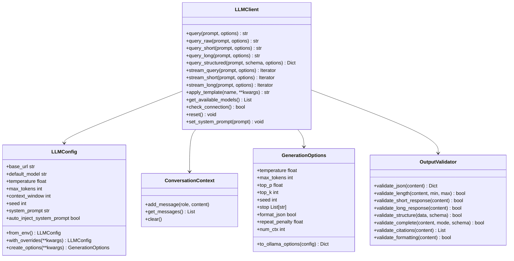

# LLM Module

## Purpose

The LLM module provides a unified interface for interacting with local large language models (via Ollama) to assist with research tasks. It offers:

- **Flexible response modes**: Short, long, structured (JSON), raw
- **Per-query configuration**: Temperature, seed, stop sequences, max_tokens
- **Comprehensive output validation**: JSON, length, structure, citations
- **Conversation context management**: System prompt injection, token limits
- **Environment-based configuration**: OLLAMA_* and LLM_* environment variables

## Architecture

This module follows the **thin orchestrator pattern** with clear separation of concerns:

### Module Structure

```
infrastructure/llm/
├── core/              # Core LLM functionality
│   ├── client.py      # LLMClient main interface
│   ├── config.py      # LLMConfig, GenerationOptions
│   └── context.py     # ConversationContext, Message
├── templates/         # Prompt templates
│   ├── base.py        # ResearchTemplate base class
│   ├── helpers.py     # Template helper functions
│   ├── research.py    # Research task templates
│   └── manuscript.py  # Manuscript review templates
├── validation/        # Output validation
│   ├── core.py        # OutputValidator
│   ├── format.py      # Format validation
│   ├── repetition.py # Repetition detection
│   └── structure.py   # Structure validation
├── review/            # Manuscript review system
│   ├── generator.py   # Review generation
│   ├── io.py          # Review I/O operations
│   └── metrics.py     # Review metrics
├── utils/             # Utility functions
│   └── ollama.py      # Ollama management
├── cli/               # Command-line interface
│   └── main.py        # CLI commands
└── prompts/           # Prompt fragment system
```

### Core Components

1. **LLMClient** - Main interface for querying LLMs
   - Query methods for different response modes (short, long, structured, raw)
   - Streaming support with per-query options
   - Model fallback mechanism
   - Connection management
   - System prompt injection

2. **LLMConfig** - Configuration management
   - Environment variable loading (OLLAMA_HOST, OLLAMA_MODEL, LLM_*)
   - Model settings and generation defaults
   - Response mode token limits
   - System prompt configuration

3. **GenerationOptions** - Per-query generation control
   - Temperature, max_tokens, top_p, top_k
   - Seed for reproducibility
   - Stop sequences
   - Native JSON format mode
   - Repeat penalty, num_ctx

4. **ConversationContext** - Multi-turn conversation management
   - Message history tracking
   - Token limit enforcement
   - Context pruning strategies
   - System prompt preservation

5. **ResearchTemplate** - Structured prompt templates
   - Pre-built prompts for common research tasks
   - Variable substitution
   - Template registry

6. **OutputValidator** - Comprehensive output quality assurance
   - JSON validation and parsing
   - Response length checking
   - Format validation
   - Citation extraction
   - Mode-specific validation (short/long/structured)

### Architecture Diagram



## Configuration

### Environment Variables

The module reads configuration from environment variables:

| Variable | Default | Description |
|----------|---------|-------------|
| `OLLAMA_HOST` | `http://localhost:11434` | Ollama server URL |
| `OLLAMA_MODEL` | `gemma3:4b` | Default model name (128K context, fast) |
| `LLM_TEMPERATURE` | `0.7` | Generation temperature |
| `LLM_MAX_TOKENS` | `2048` | Maximum tokens per response |
| `LLM_CONTEXT_WINDOW` | `131072` | Context window size (128K default for gemma3:4b) |
| `LLM_TIMEOUT` | `60` | Request timeout (seconds) |
| `LLM_NUM_CTX` | `None` | Ollama num_ctx parameter |
| `LLM_SEED` | `None` | Default seed for reproducibility |
| `LLM_SYSTEM_PROMPT` | Research assistant | Custom system prompt |

### Programmatic Configuration

```python
from infrastructure.llm.core.config import LLMConfig
from infrastructure.llm.core.client import LLMClient

config = LLMConfig(
    base_url="http://localhost:11434",
    default_model="gemma3:4b",
    temperature=0.7,
    max_tokens=2048,
    context_window=131072,  # 128K context (supports gemma3:4b)
    seed=42,  # For reproducibility
    system_prompt="You are an expert research assistant.",
    auto_inject_system_prompt=True,
)

client = LLMClient(config)

# Create override configuration
fast_config = config.with_overrides(temperature=0.0, timeout=30.0)
```

## Response Modes

The LLMClient supports four distinct response modes:

### 1. Standard Query
Conversational query with context management:

```python
client = LLMClient()
response = client.query("What is quantum computing?")
# Context maintained for follow-up
response2 = client.query("Can you explain that further?")
```

### 2. Short Responses (< 150 tokens)
Brief, direct answers with limited token output:

```python
answer = client.query_short("What is machine learning?")
# Automatically limits max_tokens to short_max_tokens (200)
```

**Use cases:**
- Quick summaries
- Yes/no questions
- Definitions
- Brief explanations

### 3. Long Responses (> 500 tokens)
Comprehensive, detailed answers with extended output:

```python
explanation = client.query_long("Explain neural networks in detail")
# Automatically sets max_tokens to long_max_tokens (16384)
```

**Use cases:**
- In-depth analysis
- Technical documentation
- Literature reviews
- Detailed explanations

### 4. Structured Responses (JSON)
Formatted data with validation against schema:

```python
schema = {
    "type": "object",
    "properties": {
        "summary": {"type": "string"},
        "key_points": {"type": "array"},
        "confidence": {"type": "number"}
    },
    "required": ["summary", "key_points"]
}

result = client.query_structured(
    "Analyze this paper...",
    schema=schema,
    use_native_json=True  # Uses Ollama format="json"
)
```

**Use cases:**
- Data extraction
- Structured analysis
- Program-friendly output
- Validated responses

### 5. Raw Queries
Direct prompts without system prompt or instructions:

```python
response = client.query_raw("Complete: The quick brown fox")
# Bypasses context and system prompt
```

## Per-Query Generation Options

Control generation behavior per-query with `GenerationOptions`:

```python
from infrastructure.llm.core.config import GenerationOptions

# Deterministic output
opts = GenerationOptions(
    temperature=0.0,
    seed=42,
)
response = client.query("...", options=opts)

# Full control
opts = GenerationOptions(
    temperature=0.7,      # Creativity (0.0=deterministic, 2.0=creative)
    max_tokens=1000,      # Max output tokens (num_predict)
    top_p=0.9,            # Nucleus sampling threshold
    top_k=40,             # Top-k sampling limit
    seed=42,              # Random seed for reproducibility
    stop=["END", "STOP"], # Stop sequences
    format_json=True,     # Force JSON output (Ollama native)
    repeat_penalty=1.1,   # Penalty for repetition
    num_ctx=8192,         # Context window for this query
)
```

### Options Precedence

1. Per-query `GenerationOptions` (highest priority)
2. `LLMConfig` defaults
3. Environment variables (via `LLMConfig.from_env()`)

## System Prompt Management

### Automatic Injection

By default, the system prompt is automatically injected:

```python
config = LLMConfig(
    system_prompt="You are an expert researcher.",
    auto_inject_system_prompt=True,  # Default
)
client = LLMClient(config)
# System prompt is first message in context
```

### Manual Control

```python
# Disable automatic injection
config = LLMConfig(auto_inject_system_prompt=False)
client = LLMClient(config)

# Set new system prompt (resets context)
client.set_system_prompt("New persona...")

# Reset context and re-inject system prompt
client.reset()
```

## Streaming Responses

### Basic Streaming

```python
for chunk in client.stream_query("Write a haiku about AI"):
    print(chunk, end="", flush=True)
```

### Mode-Specific Streaming

```python
# Short mode streaming
for chunk in client.stream_short("What is X?"):
    print(chunk, end="")

# Long mode streaming
for chunk in client.stream_long("Detailed explanation..."):
    print(chunk, end="")
```

### Streaming with Options

```python
opts = GenerationOptions(temperature=0.9, seed=42)
for chunk in client.stream_query("...", options=opts):
    print(chunk, end="")
```

## Templates

### Available Templates

| Template | Purpose | Parameters |
|----------|---------|------------|
| `summarize_abstract` | Summarize research abstracts | `text` |
| `literature_review` | Synthesize multiple summaries | `summaries` |
| `code_doc` | Generate Python docstrings | `code` |
| `data_interpret` | Interpret statistical results | `stats` |

### Using Templates

```python
summary = client.apply_template(
    "summarize_abstract",
    text=abstract_text
)

review = client.apply_template(
    "literature_review",
    summaries=summaries_text
)
```

### Creating Custom Templates

```python
from infrastructure.llm.templates.base import ResearchTemplate

class MyTemplate(ResearchTemplate):
    template_str = (
        "Analyze the following with focus on ${aspect}:\n\n"
        "${content}"
    )

# Use it
template = MyTemplate()
result = template.render(aspect="limitations", content="...")
```

## Validation

The `OutputValidator` provides comprehensive output quality assurance:

### JSON Validation

```python
# Parse JSON with markdown handling
data = OutputValidator.validate_json(response)

# Handles markdown-wrapped JSON automatically
# "```json\n{\"key\": \"value\"}\n```" → {"key": "value"}
```

### Response Mode Validation

```python
# Verify response meets mode requirements
OutputValidator.validate_short_response(response)  # < 150 tokens
OutputValidator.validate_long_response(response)   # > 500 tokens
```

### Structure Validation

```python
schema = {
    "type": "object",
    "properties": {
        "name": {"type": "string"},
        "items": {"type": "array"}
    },
    "required": ["name"]
}

OutputValidator.validate_structure(data, schema)
```

### Citation Extraction

```python
citations = OutputValidator.validate_citations(content)
# Extracts: (Author Year), [1], @bibtexkey formats
```

### Comprehensive Validation

```python
OutputValidator.validate_complete(
    response,
    mode="structured",
    schema=my_schema
)
```

## Testing

### No Mocks Policy

Following the project's **No Mocks Policy**, LLM tests are structured as:

1. **Pure Logic Tests** (93 tests) - Test configuration, validation, context, templates
   - Use real data and computations
   - No MagicMock, mocker.patch, or unittest.mock
   - Run without network access

2. **Integration Tests** (12 tests) - Test actual Ollama interactions
   - Marked with `@pytest.mark.requires_ollama`
   - Auto-skip when Ollama unavailable
   - Test real LLM responses

### Test Coverage

| Test File | Tests | Coverage |
|-----------|-------|----------|
| `test_config.py` | 38 | Configuration & environment |
| `test_core.py` | 26 | LLMClient pure logic + integration |
| `test_context.py` | 4 | Context management |
| `test_templates.py` | 4 | Template rendering |
| `test_validation.py` | 26 | Output validation |
| **Total** | **98+** | **95%+** |

### Running Tests

```bash
# Pure logic tests only (no Ollama required)
pytest tests/infrastructure/llm/ -m "not requires_ollama" -v

# All tests (requires running Ollama)
pytest tests/infrastructure/llm/ -v

# Integration tests only
pytest tests/infrastructure/llm/ -m requires_ollama -v

# With coverage
pytest tests/infrastructure/llm/ --cov=infrastructure.llm --cov-report=html
```

## Error Handling

### Connection Errors

The LLM client includes automatic retry logic for transient connection failures:

```python
from infrastructure.core.exceptions import (
    LLMConnectionError,
    LLMTemplateError,
    ValidationError,
    ContextLimitError
)

try:
    response = client.query("...")
except LLMConnectionError as e:
    print(f"Connection failed: {e.context}")
    # Context includes: url, model, status_code (if HTTP error)
except ContextLimitError as e:
    print(f"Context limit exceeded: {e.context}")
```

### Connection Health Checks

Check Ollama availability with detailed error information:

```python
# Simple boolean check (backward compatible)
if client.check_connection():
    print("Ollama is ready")

# Detailed status with error message
is_available, error = client.check_connection_detailed()
if not is_available:
    print(f"Ollama unavailable: {error}")
```

### Retry Logic

The client automatically retries on transient failures:
- **Connection errors**: Retried with exponential backoff
- **Timeouts**: Retried with increasing wait times
- **HTTP errors (4xx/5xx)**: Not retried (not transient)

Retry behavior:
- Default: 1 retry attempt
- Wait time: Exponential backoff (1s, 2s, max 5s)
- Logs retry attempts at DEBUG level

## Performance Considerations

### Token Management

- Context automatically prunes old messages when token limit approaches
- System prompt is preserved during pruning
- Token estimation: ~4 characters per token

### Reproducibility

- Use `seed` parameter for deterministic outputs
- Set via `GenerationOptions(seed=42)` or `LLM_SEED` env var
- Combined with `temperature=0.0` for fully reproducible results

### Model Fallback

- Automatically tries fallback models on connection failure
- Configurable fallback list in `LLMConfig.fallback_models`
- Logs fallback attempts

## Integration with Other Modules

The LLM module integrates with:
- **infrastructure.core** - Logging, exceptions, configuration
- **infrastructure.literature** - Literature search summarization
- **infrastructure.validation** - Output quality assurance
- **infrastructure.rendering** - Documentation generation

## Command-Line Interface

The LLM module includes a CLI for interactive queries from the terminal.

### CLI Commands

```bash
# Check Ollama connection
python3 -m infrastructure.llm.cli.main check

# List available models
python3 -m infrastructure.llm.cli.main models

# Query the LLM
python3 -m infrastructure.llm.cli.main query "What is machine learning?"

# Short response mode
python3 -m infrastructure.llm.cli.main query --short "Summarize X"

# Long response mode
python3 -m infrastructure.llm.cli.main query --long "Explain X in detail"

# Streaming output
python3 -m infrastructure.llm.cli.main query --stream "Write a poem"

# With generation options
python3 -m infrastructure.llm.cli.main query --temperature 0.0 --seed 42 --max-tokens 500 "Test"

# Apply research templates
python3 -m infrastructure.llm.cli.main template --list
python3 -m infrastructure.llm.cli.main template summarize_abstract --input "Abstract text..."
```

### CLI Options

| Command | Option | Description |
|---------|--------|-------------|
| `query` | `--short` | Request short response (< 150 tokens) |
| `query` | `--long` | Request detailed response (> 500 tokens) |
| `query` | `--stream` | Stream response in real-time |
| `query` | `--model` | Override default model |
| `query` | `--temperature` | Sampling temperature (0.0 = deterministic) |
| `query` | `--max-tokens` | Maximum tokens to generate |
| `query` | `--seed` | Random seed for reproducibility |
| `template` | `--list` | List available templates |
| `template` | `--input` | Input text for template |

## Troubleshooting

### Connection Issues

**Check Ollama Status:**
```python
# Simple check
if not client.check_connection():
    print("Ollama not running")
    # Start Ollama: ollama serve

# Detailed diagnosis
is_available, error = client.check_connection_detailed()
if not is_available:
    print(f"Ollama unavailable: {error}")
    if "timeout" in error.lower():
        print("  → Ollama may be slow to respond, try increasing timeout")
    elif "connection" in error.lower():
        print("  → Ollama server may not be running")
        print("  → Start with: ollama serve")
```

**Common Issues:**
- **Timeout errors**: Increase `LLM_TIMEOUT` environment variable or config timeout
- **Connection refused**: Ensure Ollama server is running (`ollama serve`)
- **Model not found**: Install model with `ollama pull <model_name>`
- **Empty responses**: Check model is loaded and has sufficient memory

### Model Preloading

Preload models to reduce first-query latency:

```python
from infrastructure.llm.utils.ollama import preload_model

# Preload with error handling
success, error = preload_model("llama3:latest", timeout=60.0)
if not success:
    print(f"Preload failed: {error}")
    print("Model will load on first query (may be slower)")
else:
    print("Model preloaded successfully")
```

**Preload Behavior:**
- Checks if model is already loaded (avoids redundant preloads)
- Retries on transient failures
- Returns detailed error messages
- Timeout may indicate model is still loading (not necessarily failed)

### Context Overflow

```python
# Clear context if too long
client.reset()

# Or query with reset_context=True
response = client.query("...", reset_context=True)
```

### Invalid Responses

```python
try:
    OutputValidator.validate_complete(response, mode="structured")
except ValidationError as e:
    print(f"Validation failed: {e}")
```

## Manuscript Review Integration

The LLM module is used by `scripts/06_llm_review.py` to generate comprehensive manuscript reviews. This section documents best practices for long-form review generation.

### Review Generation Best Practices

#### Use `query()` Instead of `query_long()` with Detailed Templates

When your prompt template already contains detailed instructions (word count requirements, section structure, etc.), use `query()` directly instead of `query_long()`:

```python
# BAD: query_long() adds conflicting instructions
response = client.query_long(detailed_template_prompt)

# GOOD: Let the template be the sole instruction
response = client.query(detailed_template_prompt, options=options)
```

This avoids "double instruction" confusion where the model receives conflicting guidance.

#### Off-Topic Detection

Implement off-topic detection to catch when the LLM has gone off-track:

```python
# Common off-topic patterns
OFF_TOPIC_PATTERNS = [
    r"^Re:\s",           # Email reply format
    r"^Dear\s",          # Letter format
    r"^Hi\s",            # Casual greeting
    r"I'm happy to help", # AI assistant phrase
    r"As an AI",         # AI self-reference
    r"```python",        # Code when text expected
]

def is_off_topic(response: str) -> bool:
    for pattern in OFF_TOPIC_PATTERNS:
        if re.search(pattern, response, re.IGNORECASE):
            return True
    return False
```

#### Format Enforcement on Retry

When retrying failed generations, add explicit format enforcement:

```python
FORMAT_ENFORCEMENT = {
    "executive_summary": (
        "IMPORTANT: Your response MUST use these exact markdown headers:\n"
        "## Overview\n## Key Contributions\n## Methodology Summary\n"
        "## Principal Results\n## Significance and Impact\n\n"
    ),
    "quality_review": (
        "IMPORTANT: Include scoring using: **Score: [1-5]**\n\n"
    ),
}

# On retry
if attempt > 0:
    prompt = FORMAT_ENFORCEMENT[review_type] + original_prompt
```

#### Review Validation

Validate review structure before accepting:

```python
def validate_review(response: str, review_type: str) -> Tuple[bool, List[str]]:
    issues = []
    
    # Check off-topic first
    if is_off_topic(response):
        return False, ["Response appears off-topic"]
    
    # Check word count
    word_count = len(response.split())
    min_words = {"executive_summary": 300, "quality_review": 400}
    if word_count < min_words.get(review_type, 200):
        issues.append(f"Too short: {word_count} words")
    
    # Check structure (type-specific)
    if review_type == "executive_summary":
        required = ["overview", "methodology", "results"]
        found = sum(1 for h in required if h in response.lower())
        if found < 2:
            issues.append("Missing expected sections")
    
    return len(issues) == 0, issues
```

### Review Generation Options

For long-form reviews, use these recommended settings:

```python
options = GenerationOptions(
    temperature=0.3,       # Low for consistency
    max_tokens=16384,      # Allow long responses
    seed=42,               # Reproducibility
)
```

### Retry Strategy

Implement retries with increasing temperature:

```python
for attempt in range(max_retries + 1):
    if attempt > 0:
        client.reset()  # Clear context
        options = GenerationOptions(
            temperature=min(0.3 + 0.1 * attempt, 0.7),
            max_tokens=4096,
        )
        # Add format enforcement
        prompt = FORMAT_ENFORCEMENT[type] + original_prompt
    
    response = client.query(prompt, options=options)
    
    is_valid, issues = validate_review(response, review_type)
    if is_valid:
        break
```

### Integration with Review Script

The review script (`scripts/06_llm_review.py`) uses these patterns:

1. **Check Ollama availability** before starting
2. **Extract full manuscript text** from PDF
3. **Generate reviews** with validation and retry
4. **Save outputs** with detailed metrics

## Model Behavior Notes

Different models exhibit different behaviors. The manuscript review system automatically adjusts for model size:

### Small Models (3B-8B parameters)

**Examples:** `qwen3:4b`, `llama3:8b`, `phi3`

**Characteristics:**
- Tend to use creative formatting (emojis, tables, decorative headers)
- May not follow exact header structure requested
- Need slightly higher temperature (0.4 vs 0.3) for better output
- 20% lower word count thresholds are acceptable

**Adjustments applied:**
- Temperature increased by 0.1
- Minimum word counts reduced by 20%
- Flexible section header matching (accepts variations)

### Large Models (14B+ parameters)

**Examples:** `qwen3:14b`, `llama3:70b`, `mixtral`

**Characteristics:**
- Follow formatting instructions more precisely
- Produce more consistent structure
- Handle complex prompts well
- Standard thresholds apply

**Adjustments applied:**
- Default temperature settings
- Standard word count requirements
- Stricter section header matching

### Template Design for Model Compatibility

Templates now use upfront format requirements to work with all model sizes:

```python
template_str = """CRITICAL FORMAT REQUIREMENTS:
1. Use ONLY these headers: ## Section1, ## Section2
2. DO NOT use emojis, tables, or decorative formatting
3. Write [X-Y] words total

EXAMPLE FORMAT:
## Section1
Content here...

---
MANUSCRIPT TEXT:
${text}"""
```

Key principles:
1. Put format requirements FIRST (before content)
2. Include a brief example of expected output
3. Explicitly forbid problematic formatting
4. Place manuscript text at the END

### Validation Flexibility

The validation system accepts multiple valid formats:

| Expected | Also Accepted |
|----------|---------------|
| `## Overview` | "overview", "summary", "introduction" |
| `**Score: 4/5**` | "Score: 4", "4/5", "Rating: 4" |
| `## Strengths` | "strengths", "advantages", "pros" |
| `## High Priority` | "critical", "urgent", "must fix" |

### Troubleshooting Model Issues

**Issue: Response uses emojis and tables**
- Templates explicitly forbid this with "FORBIDDEN" sections
- Format compliance validation detects and logs violations
- Small models get format warnings (non-blocking); large models get stricter checks
- See Format Compliance Validation below

**Issue: Missing expected headers**
- Validation accepts semantic equivalents
- Only requires 1+ matching section (very flexible)

**Issue: Response starts with "Based on..."**
- This is detected as a conversational phrase
- For small models, it becomes a warning; for large models, an issue

**Issue: Response contains hallucinated section references**
- Validation detects suspicious references like "Section 12.8.1" or "page 44"
- These are logged as format compliance issues

**Issue: Validation retries repeatedly**
- Reduced max_retries from 2 to 1
- Validation accepts "good enough" responses
- Model-specific thresholds prevent false rejections

## Format Compliance Validation

The validation system includes comprehensive format compliance checking that detects common LLM failure modes:

### Detection Categories

| Category | What's Detected | Example |
|----------|-----------------|---------|
| **Emojis** | Unicode symbols, checkmarks, stars | 🚀 ✅ 💡 🔑 ⚙️ |
| **Tables** | Markdown table separators | `\| col \| col \|` with `\|---\|---\|` |
| **Conversational** | AI assistant phrases | "Based on the document you shared", "I'll help you" |
| **Hallucinations** | Fictional section references | "Section 12.8.1", "page 44", "Section 14.3" |

### Validation Functions

```python
from scripts import (
    detect_emojis,
    detect_tables,
    detect_conversational_phrases,
    detect_hallucinated_sections,
    check_format_compliance,
)

# Individual detection
emojis = detect_emojis(response)      # Returns list of emojis found
has_tables = detect_tables(response)  # Returns bool
phrases = detect_conversational_phrases(response)  # Returns list of phrases
refs = detect_hallucinated_sections(response)      # Returns list of refs

# Comprehensive check
is_compliant, issues, details = check_format_compliance(response)
# issues: ["Contains 3 emoji(s) - violates format requirements", ...]
# details: {"emojis_found": [...], "has_tables": False, ...}
```

### Model-Specific Behavior

The validation system applies different strictness based on model size:

| Model Size | Emoji/Table Violations | Conversational Phrases | Hallucinated Refs |
|------------|------------------------|------------------------|-------------------|
| Small (3B-8B) | Warnings (non-blocking) | Warnings | Warnings |
| Large (14B+) | Issues (may cause retry) | Issues | Issues |

### Logging Output

Format compliance is logged at INFO level:

```
  ✓ Executive Summary generated
    Output: 4,894 chars (570 words) in 34.2s
    Format notes: 3 emoji(s), conversational phrases
```

For validation failures:

```
    Validation issues: Contains 5 emoji(s) - violates format requirements - retrying
```

### Template Design to Prevent Violations

Templates now include strict "FORBIDDEN" sections:

```python
template_str = """STRICT REQUIREMENTS - FAILURE TO FOLLOW WILL RESULT IN REJECTION:

FORBIDDEN (DO NOT USE):
- NO emojis (no checkmarks, stars, rockets, light bulbs, etc.)
- NO markdown tables (no | column | separators |)
- NO conversational phrases ("I'll help you", "Let me know", "Based on your document")
- NO invented section numbers (do not reference "Section 12.8" or similar)
- NO fabricated statistics or benchmarks not in the manuscript

REQUIRED FORMAT - Use ONLY these exact headers:
## Overview
## Key Contributions
...
"""
```

### Expected vs Actual Output Examples

**❌ Bad Response (with violations):**
```markdown
## Overview 🔑

Based on the document you shared, this is an excellent manuscript! 🚀

| Aspect | Assessment |
|--------|------------|
| Quality | Excellent |

As described in Section 12.8.1, the framework provides great results.
Let me know if you need more details!
```

**✅ Good Response (compliant):**
```markdown
## Overview

The manuscript presents a research framework for optimization algorithms.

## Key Contributions

- Novel algorithm design with improved convergence
- Comprehensive experimental validation
- Open-source implementation

## Methodology Summary

The research employs gradient-based optimization techniques...
```

## See Also

- [`README.md`](README.md) - Quick reference guide
- [`../AGENTS.md`](../AGENTS.md) - Infrastructure layer documentation
- [`../../.cursorrules/llm_standards.md`](../../.cursorrules/llm_standards.md) - LLM development standards
- [`../../scripts/06_llm_review.py`](../../scripts/06_llm_review.py) - Manuscript review script
- [Ollama Documentation](https://ollama.ai/)
